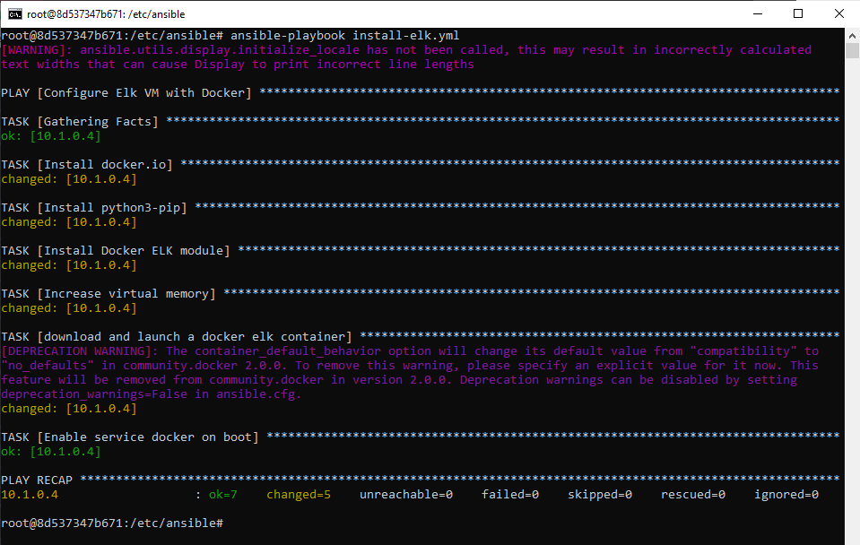
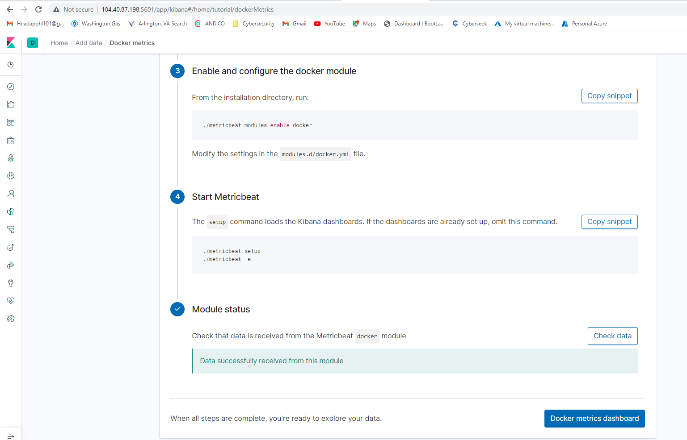

# Day 1:

### Step 1: Create New Virtual Network in different region

### Step 1: Create Peer Connection Between Vnets

### Step 2: Log into ansible container in JumpBox

### Step 2: Get ssh public key from ansible container

### Step 2: Create new ELK-SERVER Vm

### Step 2: Ensure jumpbox can connect to ELK-SERVER

### Step 2: Test VM connection

### Step 3: Modify ansible hosts file to create [elk] group with ELK-SERVER’s IP

### Step 3: Create ansible playbook to install elk stack on ELK-SERVER

### Step 4: Run the install-elk playbook by running **ansible-playbook install-elk.yml**

### Step 4: SSH from ansible to ELK_SERVER and use sudo docker ps to verify that the elk container is running

### Step 5: Add inbound rule to NSG to allow access to Kibana on port 5601

### Step 5: Log into Kibana on port 5601 from the local machine. Success!

# Day 2

### Part 2: create and edit filebeat-config.yml

### Change hosts to 10.1.0.4:9200

### Part 3: use touch to create filebeat-playbook.yml

### Part 3: Write YAML playbook script to install and run filebeat on hosts [webservers], enabling restart on reboot

### Part 3: Verify that playbook ran successfully

### Part 4: Verify filebeat module status in Kibana

### Part 5: Modify metricbeat-config file to have correct hosts (10.1.0.4:5601)

### Part 5: Create metricbeat-playbook.yml to install and configure metricbeat on webservers

### Part 5: Run ansible-playbook metricbeat-playbook.yml and verify playbook ran without error

### Part 5: On metricbeat installation page on ELK server, verify that metricbeat is installed and running correctly

## Congratulations! You have successfully replicated this project deployment.

